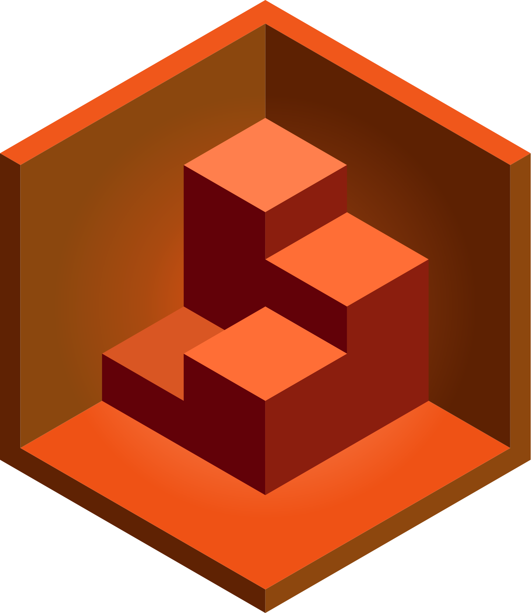
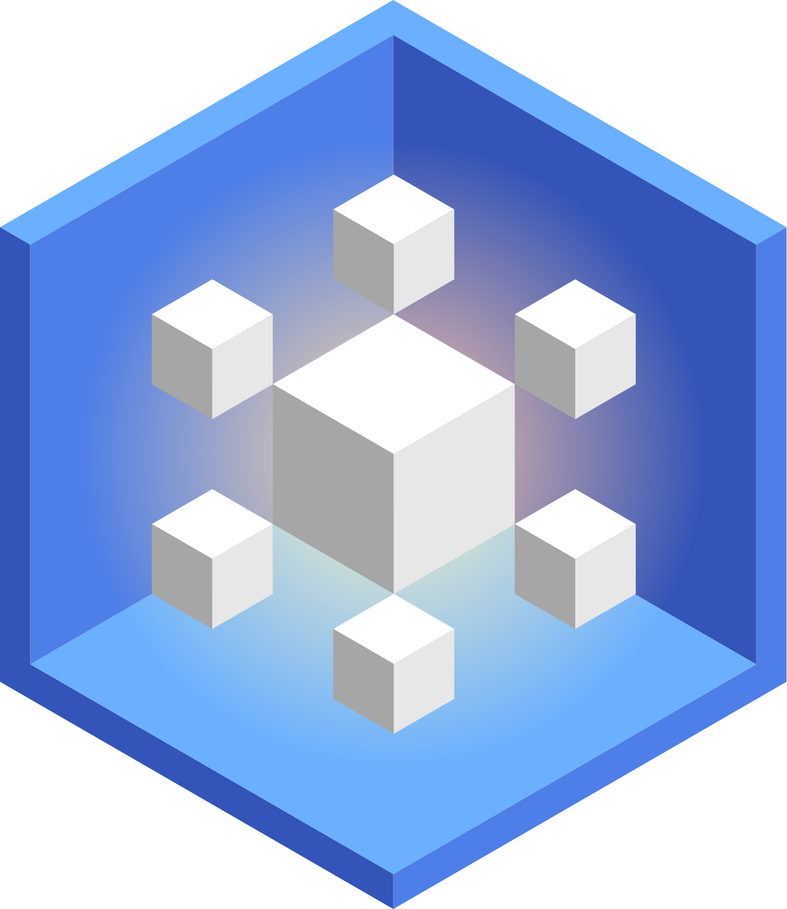
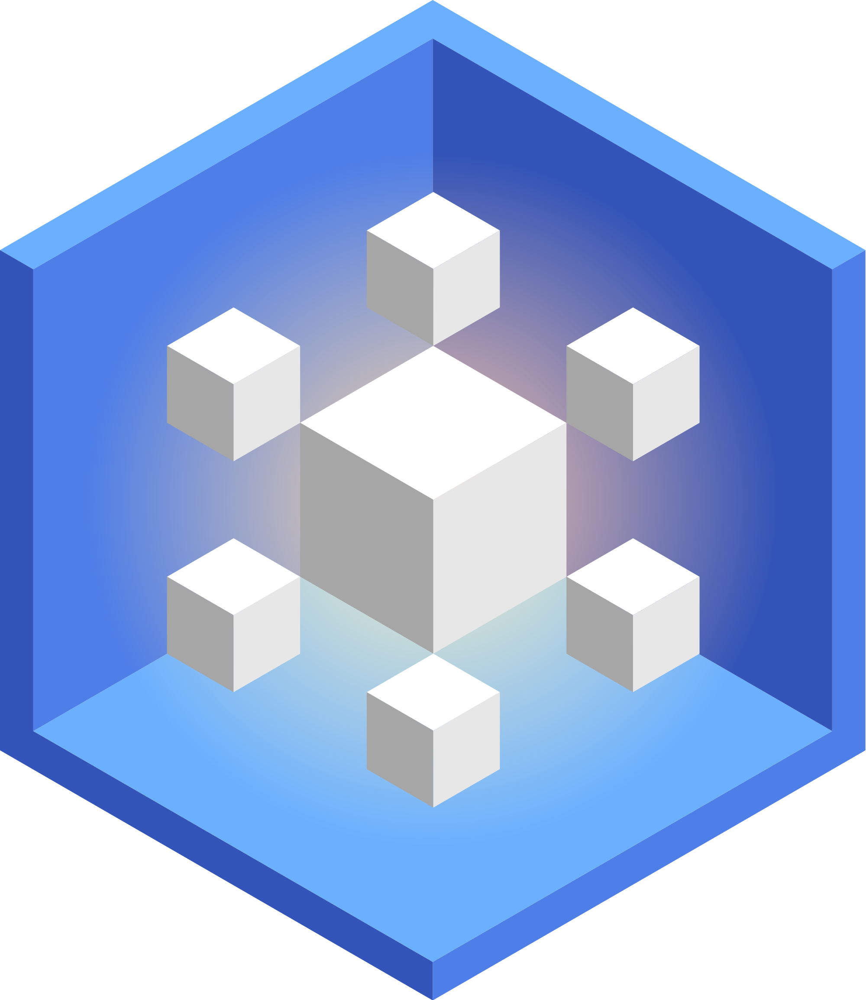
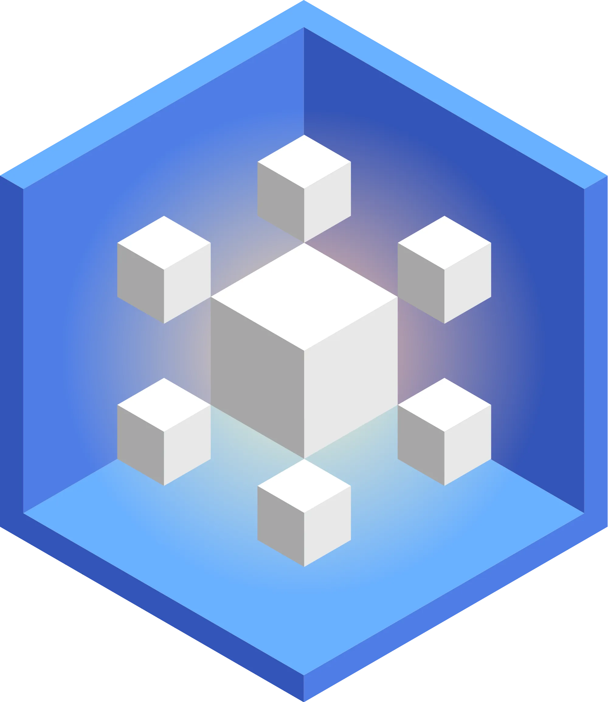
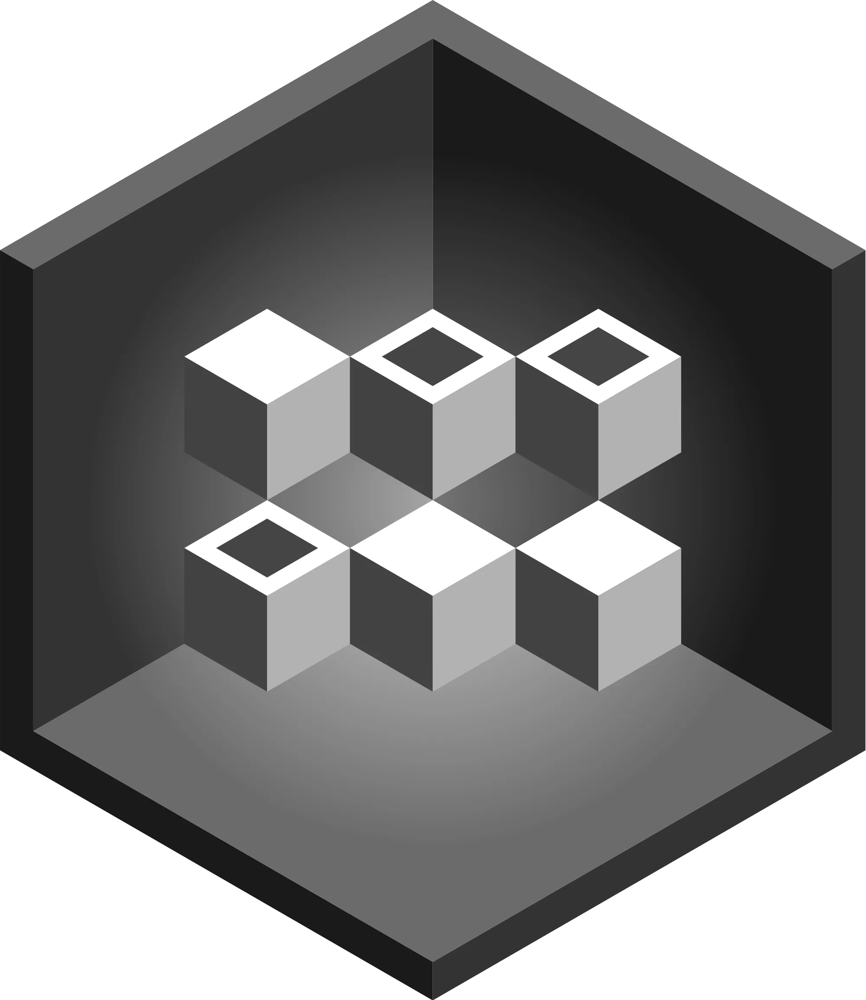
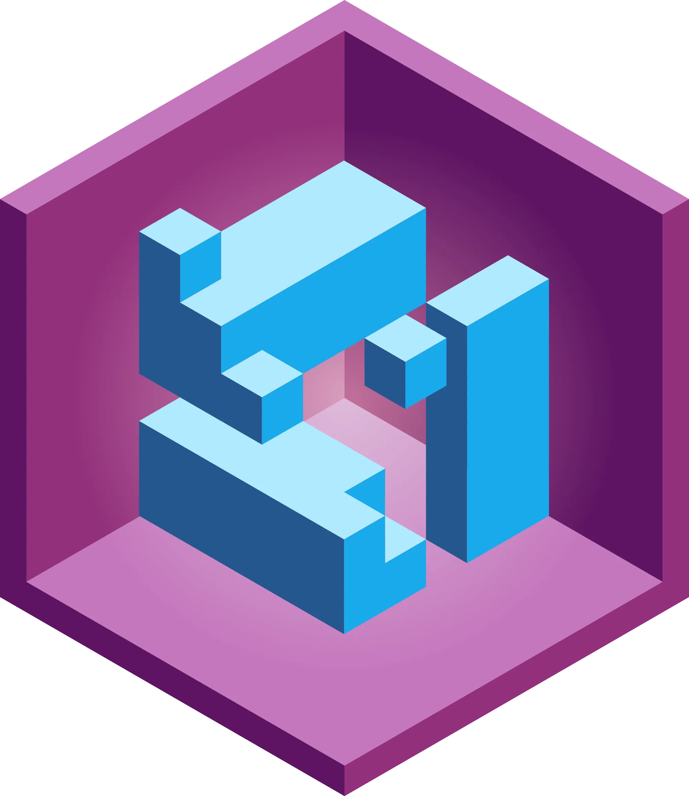

## icon-admin

### icon-admin.svg

### rendered/icon-admin.png

### rendered/icon-admin.webp

## icon-appserver

### icon-appserver.svg

### rendered/icon-appserver.png

### rendered/icon-appserver.webp

## icon-artwork

### icon-artwork.svg

### rendered/icon-artwork.png

### rendered/icon-artwork.webp

## icon-base

### icon-base.svg

### rendered/icon-base.png

### rendered/icon-base.webp

## icon-cli

### icon-cli.svg

### rendered/icon-cli.png

### rendered/icon-cli.webp

## icon-control

### icon-control.svg

### rendered/icon-control.png

### rendered/icon-control.webp

## icon-core

### icon-core.svg

### rendered/icon-core.png

### rendered/icon-core.webp

## icon-datastore

### icon-datastore.svg

### rendered/icon-datastore.png

### rendered/icon-datastore.webp

## icon-docs

### icon-docs.svg

### rendered/icon-docs.png

### rendered/icon-docs.webp

## icon-flare

### icon-flare.svg

### rendered/icon-flare.png

### rendered/icon-flare.webp

## icon-html5

### icon-html5.svg

### rendered/icon-html5.png

### rendered/icon-html5.webp

## icon-icons

### icon-icons.svg

### rendered/icon-icons.png

### rendered/icon-icons.webp

## icon-ignite

### icon-ignite.svg

### rendered/icon-ignite.png

### rendered/icon-ignite.webp

## icon-logics

### icon-logics.svg

### rendered/icon-logics.png

### rendered/icon-logics.webp

## icon-scriptor

### icon-scriptor.svg

### rendered/icon-scriptor.png

### rendered/icon-scriptor.webp

## icon-shoelace

### icon-shoelace.svg

### rendered/icon-shoelace.png

### rendered/icon-shoelace.webp

## icon-shop-components

### icon-shop-components.svg

### rendered/icon-shop-components.png

### rendered/icon-shop-components.webp

## icon-shop

### icon-shop.svg

### rendered/icon-shop.png

### rendered/icon-shop.webp

## icon-toolkit

### icon-toolkit.svg

### rendered/icon-toolkit.png

### rendered/icon-toolkit.webp

## icon-vi

### icon-vi.svg

### rendered/icon-vi.png

### rendered/icon-vi.webp

## icon-vue-components

### icon-vue-components.svg

### rendered/icon-vue-components.png

### rendered/icon-vue-components.webp

## icon-vue-utils

### icon-vue-utils.svg

### rendered/icon-vue-utils.png

### rendered/icon-vue-utils.webp

## logo-v-red

### logo-v-red.svg

### rendered/logo-v-red.png

### rendered/logo-v-red.webp

